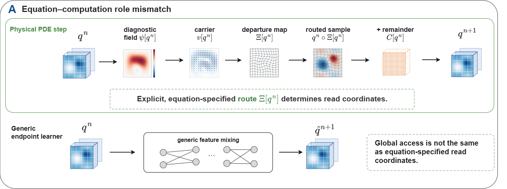
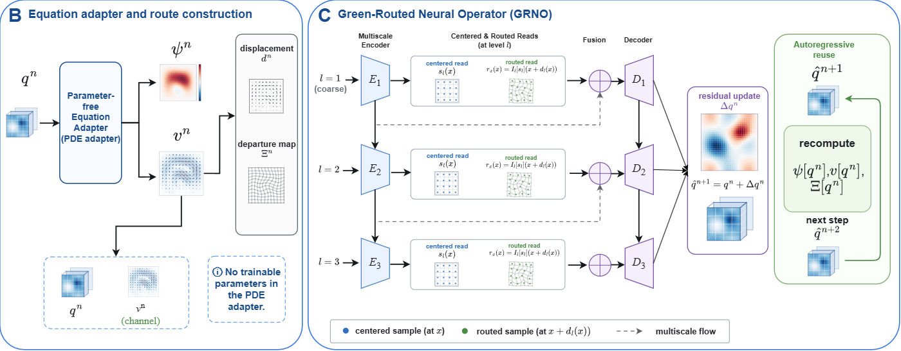
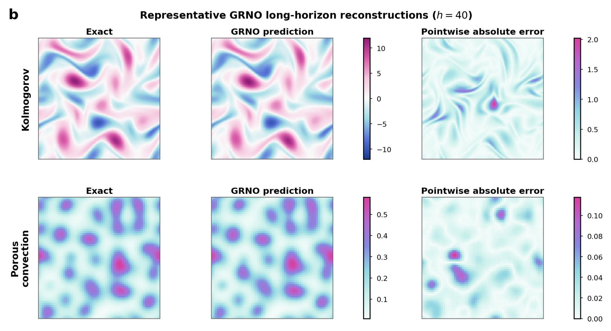
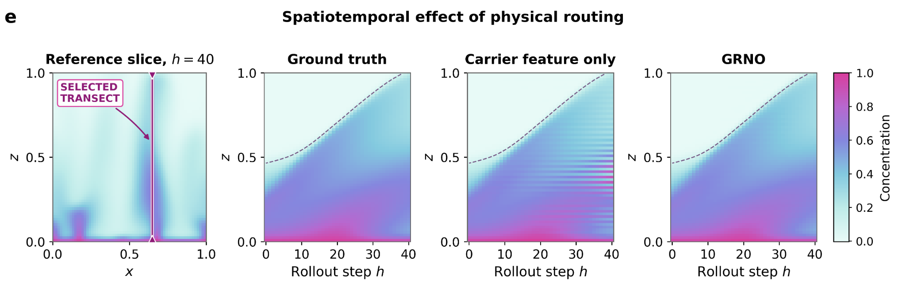

<div align="center">

# Green-Routed Neural Operators
### Physics Determines Where the Network Reads

**Chenhao Si · Ming Yan**

[Paper](https://arxiv.org/abs/2610.05337) · [PDF](https://arxiv.org/pdf/2610.05337) · [Notebooks](#code) · [Data generation](data/README.md) · [Citation](#citation)

</div>

GRNO uses known PDE transport fields to choose where a neural operator reads latent features. A deterministic equation adapter constructs departure coordinates from the current state; a multiscale encoder–decoder combines centered and routed features to predict the full state increment. The adapter is recomputed at every autoregressive step.

## Method

**From transport values to read coordinates.**



**Equation adapter and multiscale centered–routed architecture.**



The equation adapter has no trainable parameters. Within each spatial rank, the same trainable core is used across tasks, with a separate model trained for each PDE.

## Results

The paper evaluates **40-step autoregressive forecasting** on five PDE systems. GRNO has the lowest mean final error on four systems and is competitive on Keller–Segel.

Final relative L2 error **× 10⁻²**, reported as mean ± standard deviation over three training seeds (paper, Table 1). Lower is better.

| Model | Kolmogorov | SQG | Vlasov–Poisson | Keller–Segel | Porous convection |
|:--|--:|--:|--:|--:|--:|
| ReViT | 27.84 ± 1.18 | 3.25 ± 0.03 | 4.86 ± 0.90 | 1.23 ± 0.02 | 19.35 ± 1.27 |
| Flowers | 14.54 ± 5.39 | 13.12 ± 0.50 | 0.30 ± 0.01 | **0.32 ± 0.09** | 16.51 ± 2.71 |
| NIPS-AR | 134.25 ± 12.96 | 51.65 ± 0.06 | 19.33 ± 6.10 | 1.46 ± 0.39 | 69.33 ± 32.39 |
| RieszNO | 39.01 ± 0.48 | 8.07 ± 0.63 | 0.49 ± 0.05 | 0.34 ± 0.01 | 34.84 ± 1.77 |
| **GRNO** | **7.80 ± 0.56** | **2.34 ± 0.24** | **0.16 ± 0.01** | 0.37 ± 0.02 | **3.34 ± 0.16** |

**Representative reconstructions at the final forecast horizon.** Reference fields, GRNO predictions, and pointwise absolute errors for Kolmogorov flow and porous convection.



**Spatiotemporal effect of physical routing.** A selected porous-convection transect compares the reference evolution, the independently trained carrier-feature-only control, and GRNO.



## Code

This initial release contains the two shared-core GRNO research notebooks and the recovered data-generation code.

| Notebook | Systems | Spatial grid |
|:--|:--|:--|
| [GRNO 2D](notebooks/GRNO_2D_NS_SQG_VP.ipynb) | Kolmogorov Navier–Stokes, dissipative SQG, 1D1V Vlasov–Poisson | 128 × 128 |
| [GRNO 3D](notebooks/GRNO_3D_KellerSegel_PorousConvection.ipynb) | Screened Keller–Segel, Darcy–Boussinesq porous convection | 64 × 64 × 64 |

These are research implementations. Read [notebook setup and run controls](notebooks/README.md) before running: the source notebooks retain their original experiment settings and local paths, which must be configured for your machine. The paper table summarizes the manuscript experiments; a default notebook run is a separate shared-core configuration.

### Setup

Use Python 3.10 or newer and install a PyTorch build appropriate for your hardware, followed by the remaining dependencies:

```bash
git clone https://github.com/S-Chenhao/GRNO.git
cd GRNO
python -m pip install -r requirements.txt
jupyter lab
```

Full-resolution training is intended for CUDA GPUs. See [data/README.md](data/README.md) for the generator entry points and trajectory formats. Generated arrays and pretrained checkpoints are not included in this release.

## Citation

```bibtex
@misc{si2026greenrouted,
  title         = {Green-Routed Neural Operators: Physics Determines Where the Network Reads},
  author        = {Chenhao Si and Ming Yan},
  year          = {2026},
  eprint        = {2610.05337},
  archivePrefix = {arXiv},
  primaryClass  = {cs.LG},
  doi           = {10.48550/arXiv.2610.05337},
  url           = {https://arxiv.org/abs/2610.05337}
}
```

